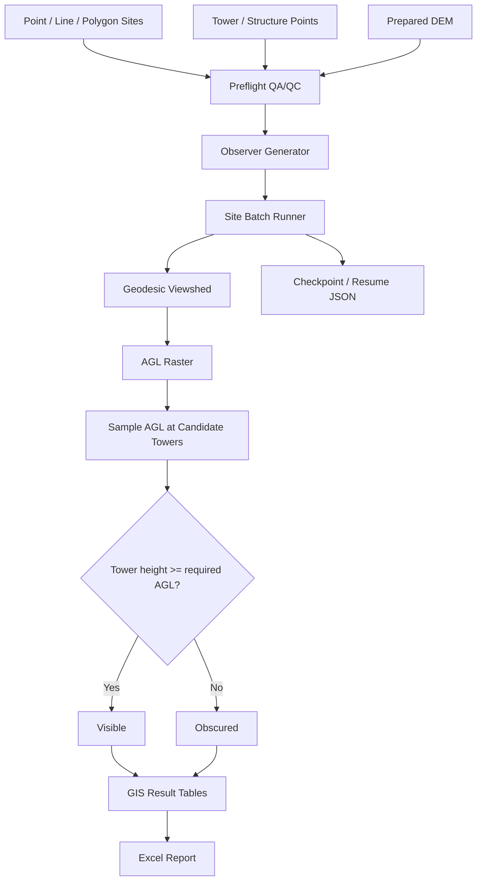

# Architecture

The Python Toolbox is the user interface; it does not contain the processing business logic. Core logic is split into small modules so the workflow can be scripted, tested, and extended.

## Module responsibilities

- `dem.py` — public USGS 3DEP acquisition, tiling, mosaic, projection, clip.
- `observers.py` — mixed-geometry observer generation.
- `validation.py` — preflight checks before expensive processing.
- `analysis.py` — one-site geodesic viewshed and AGL-based target classification.
- `status.py` — persistent site-level checkpoint/resume state.
- `runner.py` — fault-isolated batch orchestration and GIS output tables.
- `reporting.py` — Excel dashboard/detail/QA/configuration workbook.
- `ViewshedVisibilityAutomation.pyt` — ArcGIS Pro UI wrapper.

## Failure model

Structural errors stop the batch during preflight. Site-specific processing errors are caught, logged, marked `Failed`, and the next site continues. Completed sites are checkpointed immediately so they can be skipped on a resumed run.
